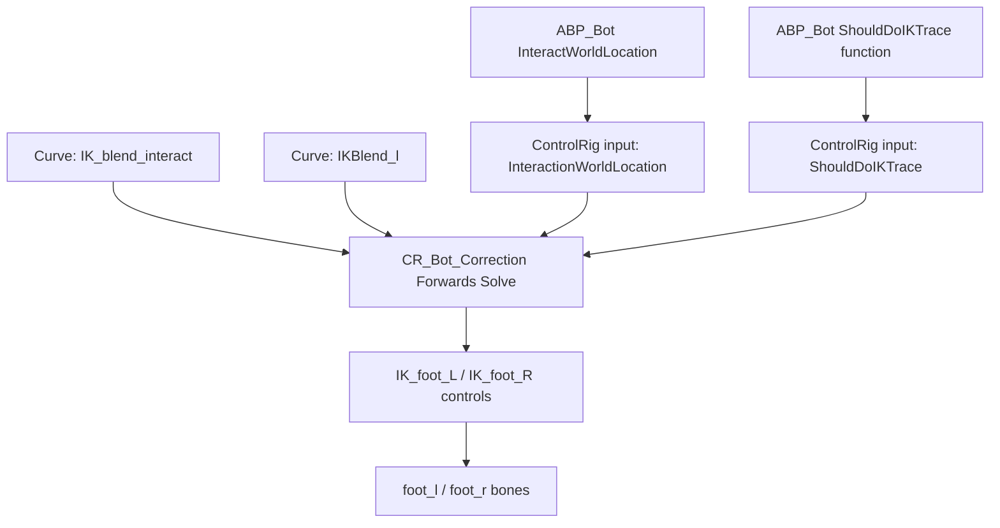
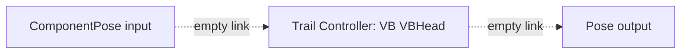

# StackOBot Animation Execution Map

This note summarizes the current learning state for StackOBot animation systems. It is based on the MCP study artifacts in:

- `D:/Git/SampleProject/StackOBot/Saved/MCP/AnimStudy`

## Runtime Pose Flow

```mermaid
flowchart LR
    Game["Gameplay / BP_Bot state"] --> AnimInstance["ABP_Bot AnimInstance"]
    AnimInstance --> StateMachine["Main AnimGraph state machine / cached poses"]
    StateMachine --> ControlRigNode["AnimGraphNode_ControlRig"]
    ControlRigNode --> FinalPose["AnimGraph Root Result"]
    FinalPose --> PostProcess["Optional SkeletalMesh Post Process AnimBP"]
    PostProcess --> ComponentPose["Final component-space skeletal pose"]
```



Current observations:

- `ABP_Bot` has an active ControlRig node in the root-connected final pose path.
- The original `SKM_Bot` has no Post Process AnimBP assigned.
- The duplicated study mesh `SKM_Bot_PostProcess_Study` proves Post Process AnimBP runs after the main AnimBP.
- The original Trail Controller node in `ABP_Bot` is disconnected and does not affect the final pose.

## System Roles

| System | Where it runs | Current StackOBot proof | Useful sample targets |
| --- | --- | --- | --- |
| Main AnimBP | `USkeletalMeshComponent` AnimInstance | `ABP_Bot` drives the base bot pose. | State machine node outputs, root chain, runtime variables. |
| Post Process AnimBP | SkeletalMesh post-process slot, after main AnimBP | Study mesh applied `head` roll delta of `4.0` degrees at runtime; two compiled variants target `head` pitch and `antenna_04_l` roll. | Parent/child bone rotation deltas: `neck_01`, `head`, antenna bones. |
| RigidBody node | AnimGraph physics pass inside AnimBP | Baddy study variants showed simulation-space and force differences on stalk bones. | Flexible bones: `R_Stalk_04`, `L_Stalk_04`, tail/head/foot controls. |
| Trail Controller | AnimGraph spring/trail node | Original `ABP_Bot` node exists but is disconnected. | `VB VBHead`, `head`, active chain output once a sample node is connected. |
| Control Rig | Active `AnimGraphNode_ControlRig` in `ABP_Bot` | Direct ControlRig probe proves `IK_blend_interact` gates foot/control movement. | `foot_l`, `foot_r`, `IK_foot_L`, `IK_foot_R`, interaction curves. |

## Main AnimBP Chains

`ABP_Bot`:

```text
GroundLocomotion -> Save GroundLocoPose
GroundLocoPose -> AirLocomotion -> Save LocomotionPose
LocomotionPose -> UpperBody Slot -> Save CashedPose_UpperBody
LocomotionPose + CashedPose_UpperBody -> LayeredBoneBlend -> Save FullBodyPose
IsInactive ? A_Bot_Idle_Inactive : FullBodyPose -> ControlRig -> Root
```

Key gates:

- `IsInactive`: selects inactive idle versus full-body pose before Control Rig.
- `InteractWorldLocation`: feeds Control Rig interaction location.
- `IsInAir?`: inverted through `NOT Boolean`, then drives Control Rig `ShouldDoIKTrace`.

Upper-body overlay:

- `AnimGraphNode_Slot_1` is the `UpperBody` slot in `DefaultGroup`.
- `LocomotionPose -> UpperBody Slot -> CashedPose_UpperBody -> LayeredBoneBlend.BlendPoses_0`.
- The `LayeredBoneBlend` base pose is also `LocomotionPose`; overlay weight is `1.0`.
- Branch filters are `pelvis BlendDepth=4`, `thigh_r BlendDepth=-1`, and `thigh_l BlendDepth=-1`.
- This means the interact/button overlay is intended to affect upper body branches while excluding leg branches.
- Artifact: `D:/Git/SampleProject/StackOBot/Saved/MCP/AnimStudy/StackOBot_SlotLayeredBlend_Inventory.md`.
- AssetRegistry probe artifact: `D:/Git/SampleProject/StackOBot/Saved/MCP/AnimStudy/StackOBot_UpperBody_InteractionReferenceProbe.md`.
- The probe found no Bot `AnimMontage` asset by class or filename. The only loaded `AnimMontage` asset found was Baddy death.
- `IA_Interact` is referenced by `IMC_ThirdPersonControls`; exact Blueprint node/call topology for the interact overlay remains unread through the current Python probe.

`ABP_Baddy`:

```text
New State Machine -> LocalToComponentSpace -> RigidBody -> ComponentToLocalSpace -> DefaultSlot -> Root
```

This is the cleanest sample in the project for studying where a physics AnimGraph node sits in the pose chain.

## Playback Asset Data

`ABP_Bot` state machines are driven by a small set of sequence and BlendSpace assets:

| Runtime value | Playback target | Asset data |
| --- | --- | --- |
| `GroundSpeed` + `LeanAmount` | `BS_Bot_WalkRunLean` | `Lean -1..1`, `Speed 0..500`; samples are walk, run, lean-left, and lean-right clips. |
| `GroundSpeed` while jumping | `BS_Bot_RunIdleJump` | `Speed 0..500`; samples are idle-jump and run-jump clips clustered around speed `54.5`. |
| Air/landing/jetpack states | Sequence players | `A_Bot_Fall`, `A_Bot_LandIdle`, `A_Bot_LandRun`, `A_Bot_Hover_Start`, `A_Bot_Hover_Loop`, `A_Bot_Hover_End`. |
| Baddy moving gate | Sequence players | `A_Baddy_Idle` and `A_Baddy_Walk`, both `0.667s` at about `30 fps`. |

Read result:

- The inspected Bot sequence set contains `14` sequences, totaling about `18.04s`.
- The inspected Baddy sequence set contains `2` sequences, totaling about `1.33s`.
- Root motion is disabled on all inspected sequences.
- Sequence notify, sync marker, and curve internals are still protected through the current Python read path.

## Source Clip Motion Profile

Direct sequence pose sampling gives a baseline before runtime graph layers:

| Area | Strongest inspected source motion | Interpretation |
| --- | --- | --- |
| Bot run/lean | `A_Bot_Run_LeanLeft foot_l` about `53.10`, `A_Bot_Run_LeanRight foot_r` about `52.70` max distance from first pose. | Ground locomotion foot motion is primarily authored in run/lean source clips before BlendSpace mixing. |
| Bot jump/land | `A_Bot_RunJump foot_r` about `33.85`, `A_Bot_LandRun foot_l` about `32.09`. | Air/landing states carry smaller but clear authored foot displacement. |
| Baddy walk | `A_Baddy_Walk TailEnd` about `36.71`, stalk bones about `20.85` to `22.26`. | Baddy source walk already moves tail/stalk bones before the RigidBody node adds secondary motion. |
| Baddy idle | Stalk bones about `3.88` to `4.24`. | Idle provides subtle authored motion, useful as baseline before physics simulation. |

Sampling interpretation:

- This profile is source-clip movement only.
- Final runtime movement can differ after BlendSpace interpolation, state transitions, Control Rig, RigidBody, slots, and Post Process AnimBP.
- Use source motion profile first, then compare against SIE/PIE final-pose samples when studying graph nodes.

## Post Process Variant Samples

Compiled sample variants under `/Game/_MCP_Sample/AnimStudy`:

| Variant | Target bone | Additive rotation | Verification |
| --- | --- | --- | --- |
| `ABP_Bot_PostProcess_Study_HeadPitch` | `head` | `Pitch=6` | AnimBP compile passed; matching duplicated mesh and actor linked. |
| `ABP_Bot_PostProcess_Study_AntennaRoll` | `antenna_04_l` | `Roll=12` | AnimBP compile passed; matching duplicated mesh and actor linked. |

Artifact: `D:/Git/SampleProject/StackOBot/Saved/MCP/AnimStudy/StackOBot_PostProcess_VariantSummary.md`.

Runtime note:

- The existing base Post Process sample has SIE proof for `head` roll propagation.
- The new variants are asset-level compiled samples only; runtime sampling was skipped to avoid map dirtying/switching after the prior world-reference cleanup crash.
- A future `sample_postprocess_pre_post_pose` API should capture pre/post pose deltas without creating persistent map actors.

Impact map artifact: `D:/Git/SampleProject/StackOBot/Saved/MCP/AnimStudy/StackOBot_PostProcess_VariantImpactMap.md`.

Impact summary:

- `HeadPitch` should affect `head` and antenna ends, matching the existing base `head` roll SIE propagation proof.
- `AntennaRoll` should affect `antenna_04_l` only; ControlRig hierarchy reports it as a leaf under `antenna_03_l`.
- Exact runtime deltas are not claimed for these variants yet.

## Baddy RigidBody Source vs Runtime Split

Offline comparison artifacts:

| Purpose | Path |
| --- | --- |
| Comparison Markdown | `D:/Git/SampleProject/StackOBot/Saved/MCP/AnimStudy/StackOBot_Baddy_RigidBody_SourceVsRuntime.md` |
| Comparison CSV | `D:/Git/SampleProject/StackOBot/Saved/MCP/AnimStudy/StackOBot_Baddy_RigidBody_SourceVsRuntime.csv` |
| Comparison JSON | `D:/Git/SampleProject/StackOBot/Saved/MCP/AnimStudy/StackOBot_Baddy_RigidBody_SourceVsRuntime.json` |
| Chart SVG | `D:/Git/SampleProject/StackOBot/Saved/MCP/AnimStudy/StackOBot_Baddy_RigidBody_SourceVsRuntime.svg` |

Result:

- The clean SIE runtime capture is closer to `A_Baddy_Idle` than `A_Baddy_Walk` for `Head_02` and `TailEnd`.
- `Head_02` stayed around `1.411` runtime max delta across all RigidBody variants; `TailEnd` stayed around `0.189`.
- RigidBody variant differences are concentrated on `R_Stalk_04` and `L_Stalk_04`.
- `WorldSpace` pushed `R_Stalk_04` to `19.836` max delta, about `95.1%` of the `A_Baddy_Walk` source value, and `L_Stalk_04` to `23.050`, about `103.6%` of walk source.
- Because the tail remains idle-scale while the stalks become walk-scale, treat this as simulation-space amplification rather than evidence that the walk clip is active.

## Bot BlendSpace Source Pose Map

Offline artifacts:

| Purpose | Path |
| --- | --- |
| Pose-map Markdown | `D:/Git/SampleProject/StackOBot/Saved/MCP/AnimStudy/StackOBot_Bot_BlendSpace_SourcePoseMap.md` |
| Pose-map CSV | `D:/Git/SampleProject/StackOBot/Saved/MCP/AnimStudy/StackOBot_Bot_BlendSpace_SourcePoseMap.csv` |
| Pose-map JSON | `D:/Git/SampleProject/StackOBot/Saved/MCP/AnimStudy/StackOBot_Bot_BlendSpace_SourcePoseMap.json` |
| Pose-map SVG | `D:/Git/SampleProject/StackOBot/Saved/MCP/AnimStudy/StackOBot_Bot_BlendSpace_SourcePoseMap.svg` |

Result:

- `BS_Bot_WalkRunLean` has a neutral walk/run line: `A_Bot_Walk` at `Lean=0`, `Speed=96.978`, and `A_Bot_Run` at `Lean=0`, `Speed=500`.
- The lean samples sit at mid-speed: `A_Bot_Run_LeanLeft` at `Lean=1`, `Speed=258.546`; `A_Bot_Run_LeanRight` at `Lean=-1`, `Speed=259.420`.
- Run and lean samples all carry about `51` to `53` max foot delta, so most big foot motion is authored before Control Rig correction.
- `BS_Bot_RunIdleJump` places `A_Bot_IdleJump` and `A_Bot_RunJump` almost on top of each other on the Speed axis (`54.485` vs `54.552`). Treat its authored sample choice as state/transition-driven; SIE axis probes now confirm the BlendSpace output can still change away from that narrow band.

## Bot BlendSpace SIE Pose Grid

Runtime-style artifacts:

| Purpose | Path |
| --- | --- |
| SIE pose grid Markdown | `D:/Git/SampleProject/StackOBot/Saved/MCP/AnimStudy/StackOBot_BlendSpace_SIEPoseGrid.md` |
| SIE pose grid CSV | `D:/Git/SampleProject/StackOBot/Saved/MCP/AnimStudy/StackOBot_BlendSpace_SIEPoseGrid.csv` |
| SIE pose grid JSON | `D:/Git/SampleProject/StackOBot/Saved/MCP/AnimStudy/StackOBot_BlendSpace_SIEPoseGrid.json` |
| SIE pose grid SVG | `D:/Git/SampleProject/StackOBot/Saved/MCP/AnimStudy/StackOBot_BlendSpace_SIEPoseGrid.svg` |

Result:

- `BS_Bot_WalkRunLean` changed under SIE input sampling; max location delta from the first sample was `66.061 cm`.
- `BS_Bot_RunIdleJump` changed under SIE input sampling; max location delta from the first sample was `35.438 cm`.
- The non-SIE full-editor `AnimationSingleNode` path wrote `StackOBot_BlendSpace_LiveTickPoseGrid.*` but returned `0.0` pose deltas, so use it as an API-gap record rather than as animation evidence.
- For current study purposes, the execution map should treat BlendSpace interpolation as proven only through SIE/game-world component tick.

## Transition Inventory Status

Current read-only transition inventory:

| Asset | State machine | Transition graph count | Current read depth |
| --- | --- | ---: | --- |
| `ABP_Bot` | `GroundLocomotion` | 2 | Exact source/target states and K2 rule summaries through `inspect_anim_state_machine_transitions`. |
| `ABP_Bot` | `AirLocomotion` | 12 | Exact source/target states, automatic sequence-player rules, and K2 rule summaries through `inspect_anim_state_machine_transitions`. |
| `ABP_Baddy` | `New State Machine` | 2 | Exact source/target states and K2 rule summaries through `inspect_anim_state_machine_transitions`. |

Learning interpretation:

- The state-machine layout is now clear enough for source/target pose-flow study.
- Source and target state names are read from editor transition nodes by the MCP C++ command, not inferred from graph paths.
- Rule summaries distinguish K2 variable/function checks from automatic sequence-player rules.
- `ABP_Bot` ground locomotion is `Idle <-> Walk/Run` gated by `GroundSpeed`.
- `ABP_Bot` air locomotion includes explicit `IsHovering`, `IsInAir?`, and `MovementInput?` gates plus automatic completion transitions for landing/jump/jetpack sequences.
- `ABP_Baddy` is the compact two-state sample: `A_Baddy_Idle <-> A_Baddy_Walk` gated by `Is Moving`.
- Artifact: `D:/Git/SampleProject/StackOBot/Saved/MCP/AnimStudy/StackOBot_StateMachine_TransitionMCPInspect.md`.
- Earlier Python-only artifact retained as protected-topology gap evidence: `D:/Git/SampleProject/StackOBot/Saved/MCP/AnimStudy/StackOBot_TransitionTopology_DeepProbe.md`.

## Runtime State Probe Status

Current non-C++ runtime-state feasibility:

| Probe | Result |
| --- | --- |
| Read AnimBP variables | Works for key variables such as `GroundSpeed`, `MovementInput?`, `IsInAir?`, `IsInactive`, `InteractWorldLocation`, and `Is Moving`. |
| Read current state name | Blocked; the Python `AnimInstance` wrapper does not expose current-state APIs. |
| Force variables on AnimInstance | Blocked; editor-world and SIE instances report that the variables cannot be edited on instances. |
| Read runtime pose/socket data | Works in delayed SIE; Bot and Baddy runtime socket transforms were sampled. |

Interpretation:

- Runtime pose sampling is viable.
- Controlled transition sampling is not viable through plain Python because the test cannot both force variables and read current state names.
- The useful next API should combine runtime state-name reading, safe variable forcing, ticking, and socket/bone sampling in one command.

## Control Rig Gate Summary



Direct probe result:

- `ShouldDoIKTrace=true` alone did not move the feet.
- `IKBlend_l=1` alone did not move the feet.
- `IK_blend_interact=1` produced measurable foot/control deltas.
- The AnimBP SIE actor probe stayed at zero because the temporary runtime setup did not produce active `IK_blend_interact` curve values.
- The read-only UnrealMCP command `controlrig_direct_gate_probe` now repeats this direct transient ControlRig probe. StackOBot live smoke on bridge port `55558` returned `success=true`, `read_only=true`, `asset_modified=false`, `6/6` successful cases, and `0` errors. Artifacts: `D:/Git/SampleProject/StackOBot/Saved/MCP/AnimStudy/StackOBot_ControlRig_DirectGateMCPProbe.*`.

Contribution synthesis:

- Offline artifact: `D:/Git/SampleProject/StackOBot/Saved/MCP/AnimStudy/StackOBot_ControlRig_Contribution_Synthesis.md`.
- Strongest source BlendSpace foot delta: `A_Bot_Run_LeanLeft foot_l`, about `53.10`.
- Strongest direct Control Rig foot delta in the probe: `0.2402`, about `0.45%` of that source clip foot delta.
- SIE AnimBP phase deltas remained `0.0` for both raw skeletal actor and spawned `BP_Bot`, and the curve probe reported `IKBlend_l=0.0`, `IK_blend_interact=0.0`.
- `ensure_controlrig_forced_driver_animbp` now creates a sample duplicate that preserves the original `ABP_Bot` upstream pose, inserts `ModifyCurve -> ControlRig`, forces `IK_blend_interact=1.0`, `IKBlend_l=1.0`, `ShouldDoIKTrace=true`, and `InteractionWorldLocation=(80,-40,80)`, and compiles with `0` errors and `0` warnings. Artifacts: `D:/Git/SampleProject/StackOBot/Saved/MCP/AnimStudy/StackOBot_ControlRigForcedDriverMCPEnsure.*`.
- `sample_controlrig_pre_post_runtime_pose` now provides read-only direct transient ControlRig pre/post solve evidence. StackOBot live smoke returned `runtime_source=direct_transient_controlrig`, `runtime_graph_prepost=false`, `asset_modified=false`, `0` errors, max translation delta `pelvis=20.9368`, and max rotation delta `calf_r=40.3937 deg`. Artifacts: `D:/Git/SampleProject/StackOBot/Saved/MCP/AnimStudy/StackOBot_ControlRigPrePostMCPProbe.*`.
- Treat Control Rig here as an active late-stage correction layer whose interaction branch requires a live curve/input gate, not as the source of the main locomotion foot arcs.

## Trail Controller Status



Original Trail settings retained in `ABP_Bot`:

- `TrailBone`: `VB VBHead`
- `BaseJoint`: `head`
- `ChainLength`: `2`
- `ChainBoneAxis`: `X`
- `bReorientParentToChild`: true
- `Alpha`: `1.0`

Current interpretation:

- Treat the original Trail node as retained reference settings, not active runtime behavior.
- The active Trail learning sample now exists in `_MCP_Sample/AnimStudy`.
- Final active sample chain:
  `LinkedInputPose -> LocalToComponentSpace -> Trail -> ComponentToLocalSpace -> Root`.
- The first activation attempt with original `TrailBone=VB VBHead` compiled with a warning that the skeleton could not find `VB VBHead`. The clean sample therefore uses a real antenna chain instead.
- Clean sample settings: `TrailBone=antenna_04_l`, `BaseJoint=head`, `ChainLength=4`, `ChainBoneAxis=X`, `Alpha=1.0`.

Trail sample assets:

| Purpose | Path |
| --- | --- |
| Active Trail Post Process AnimBP | `/Game/_MCP_Sample/AnimStudy/ABP_Bot_Trail_Study` |
| Skeletal mesh with Trail Post Process AnimBP | `/Game/_MCP_Sample/AnimStudy/SKM_Bot_Trail_Study` |
| Study actor template | `/Game/_MCP_Sample/AnimStudy/BP_Bot_Trail_StudyActor` |

Implementation note:

- UnrealMCP now has `ensure_anim_graph_trail_demo`, which creates or reuses the safe Trail demo chain and refuses non-`/Game/_MCP_Sample/` AnimBP edits unless explicitly allowed.
- `ABP_Bot_Trail_Study` compiled and saved with `0` errors and `0` warnings after switching to `antenna_04_l`.
- Runtime comparison artifacts:

| Purpose | Path |
| --- | --- |
| Runtime comparison Markdown | `D:/Git/SampleProject/StackOBot/Saved/MCP/AnimStudy/StackOBot_Bot_Trail_RuntimeComparison.md` |
| Runtime comparison JSON | `D:/Git/SampleProject/StackOBot/Saved/MCP/AnimStudy/StackOBot_Bot_Trail_RuntimeComparison.json` |
| Runtime comparison CSV | `D:/Git/SampleProject/StackOBot/Saved/MCP/AnimStudy/StackOBot_Bot_Trail_RuntimeComparison.csv` |
| Runtime comparison chart | `D:/Git/SampleProject/StackOBot/Saved/MCP/AnimStudy/StackOBot_Bot_Trail_RuntimeComparison.svg` |

Runtime interpretation:

- Editor tick alone produced no measurable Trail-vs-raw difference.
- SIE with only the skeletal mesh asset's Post Process AnimBP assignment also produced no measurable Trail-vs-raw difference on transient proof actors.
- SIE with explicit runtime component override, `set_override_post_process_anim_bp(ABP_Bot_Trail_Study_C, true)`, produced a clear Trail-vs-raw difference.
- Strongest measured Trail-vs-raw distance was `antenna_04_l`, about `2.945 cm`.
- The response increases toward the antenna leaf, which matches the expected Trail Controller direction.
- Temporary SIE/editor proof actors were removed. The current map package stayed dirty from reversible temp actor spawning; close the editor without saving to discard it rather than saving over `/Game/StackOBot/Maps/Lvl_Empty`.

Isolated Trail source-vs-output sampler artifacts:

| Purpose | Path |
| --- | --- |
| Isolated Trail raw JSON | `D:/Git/SampleProject/StackOBot/Saved/MCP/AnimStudy/StackOBot_AnimNodePrePostTrailIsolatedTempSmoke_raw.json` |
| Isolated Trail summary JSON | `D:/Git/SampleProject/StackOBot/Saved/MCP/AnimStudy/StackOBot_AnimNodePrePostTrailIsolatedTempSmoke_Summary.json` |
| FakeVelocity matrix JSON | `D:/Git/SampleProject/StackOBot/Saved/MCP/AnimStudy/StackOBot_AnimNodePrePostTrailIsolatedTempSmoke_FakeVelocityMatrix.json` |
| Temp cleanup check JSON | `D:/Git/SampleProject/StackOBot/Saved/MCP/AnimStudy/StackOBot_TrailIsolatedTempPostCheck.json` |

Isolated sampler interpretation:

- The no-FakeVelocity sample produced only floating-point noise, about `0.000005 cm`, because the Trail chain was static.
- A disposable `_MCP_Temp` duplicate of `ABP_Bot_Trail_Study` with `FakeVelocity=(0,0,80)` produced clear source-bypass vs post-node output.
- The strongest isolated Trail delta was `antenna_04_l`, about `21.948 cm` translation and `34.072 deg` rotation.
- Left antenna deltas increased toward the leaf (`antenna_02_l -> antenna_03_l -> antenna_04_l`), while `head` and `antenna_04_r` stayed at near-zero translation.
- The run cleaned all temp actors/assets and ended with `0` dirty content packages, `0` dirty map packages, and `0` assets under `/Game/_MCP_Temp/AnimNodePrePost`.
- This is isolated source-vs-output evidence. It still reports `runtime_graph_prepost=false` and `same_instance_prepost=false`; same-instance Trail attribution is now covered separately by `mode=pose_watch_capture` on the Post Process AnimInstance.

## Physics Pre/Post Evidence Synthesis

Physics synthesis artifacts:

| Purpose | Path |
| --- | --- |
| Synthesis Markdown | `D:/Git/SampleProject/StackOBot/Saved/MCP/AnimStudy/StackOBot_Physics_PrePostEvidenceSynthesis.md` |
| Synthesis JSON | `D:/Git/SampleProject/StackOBot/Saved/MCP/AnimStudy/StackOBot_Physics_PrePostEvidenceSynthesis.json` |
| Synthesis CSV | `D:/Git/SampleProject/StackOBot/Saved/MCP/AnimStudy/StackOBot_Physics_PrePostEvidenceSynthesis.csv` |
| Compiled node mapping summary | `D:/Git/SampleProject/StackOBot/Saved/MCP/AnimStudy/StackOBot_CompiledGraphMapping_Summary.json` |
| Compiled node mapping raw | `D:/Git/SampleProject/StackOBot/Saved/MCP/AnimStudy/StackOBot_CompiledGraphMapping_raw.json` |
| Compiled pose-link mapping summary | `D:/Git/SampleProject/StackOBot/Saved/MCP/AnimStudy/StackOBot_CompiledGraphPoseLinks_Summary.json` |
| Compiled pose-link mapping raw | `D:/Git/SampleProject/StackOBot/Saved/MCP/AnimStudy/StackOBot_CompiledGraphPoseLinks_raw.json` |
| Trail PoseWatch same-instance pre/post summary | `D:/Git/SampleProject/StackOBot/Saved/MCP/AnimStudy/StackOBot_TrailPoseWatchPrePost_Summary.json` |
| Trail PoseWatch same-instance pre/post raw | `D:/Git/SampleProject/StackOBot/Saved/MCP/AnimStudy/StackOBot_TrailPoseWatchPrePost_raw.json` |

Execution-map conclusion:

- Baddy RigidBody has active runtime evidence from SIE variants plus authored source-clip magnitude baselines.
- Bot Trail has active runtime evidence when the proof component explicitly overrides its Post Process AnimBP, isolated source-bypass vs post-node evidence through the `_MCP_Temp` sampler, and same-instance PoseWatch input/output capture through `anim_instance_source=post_process`.
- Both are sufficient for the current animation-learning baseline.
- `sample_anim_node_pre_post_runtime_pose(mode=compiled_graph_mapping)` now proves the selected `ABP_Baddy` RigidBody editor node maps to the live compiled `FAnimNode_RigidBody` instance in PIE: `same_anim_instance_node_mapping=true`, `runtime_node_instance_mapped=true`, `find_debug_anim_node_mapped=true`, and `pointer_match=true`.
- The same mode now reports runtime pose-link topology from the live node struct. The RigidBody smoke found `ComponentPose -> AnimGraphNode_LocalToComponentSpace` with `LinkID=11`, `SourceLinkID=1`, and `linked_pointer_match=true`.
- `sample_anim_node_pre_post_runtime_pose(mode=pose_watch_capture)` now covers smoked same-instance paths for `ABP_Baddy` RigidBody and `ABP_Bot_Trail_Study` Post Process Trail. The Trail smoke resolved output link `4`, input link `1`, `ABP_Bot_Trail_Study_C`, and `same_instance_prepost=true`.
- RigidBody/Trail isolated source-vs-output subtraction remains covered by `sample_anim_node_pre_post_runtime_pose(mode=isolated_temp_components)`.

## Post Process Runtime/Static Comparison

Post Process comparison artifacts:

| Purpose | Path |
| --- | --- |
| SIE dynamic samples | `D:/Git/SampleProject/StackOBot/Saved/MCP/AnimStudy/StackOBot_PostProcess_RuntimeSamples.json` |
| Static comparison Markdown | `D:/Git/SampleProject/StackOBot/Saved/MCP/AnimStudy/StackOBot_PostProcess_StaticPoseComparison.md` |
| Static comparison JSON | `D:/Git/SampleProject/StackOBot/Saved/MCP/AnimStudy/StackOBot_PostProcess_StaticPoseComparison.json` |
| Static comparison CSV | `D:/Git/SampleProject/StackOBot/Saved/MCP/AnimStudy/StackOBot_PostProcess_StaticPoseComparison.csv` |
| Static comparison chart | `D:/Git/SampleProject/StackOBot/Saved/MCP/AnimStudy/StackOBot_PostProcess_StaticPoseComparison.svg` |
| Pre/post isolation Markdown | `D:/Git/SampleProject/StackOBot/Saved/MCP/AnimStudy/StackOBot_PostProcess_PrePostPoseIsolation.md` |
| Pre/post isolation JSON | `D:/Git/SampleProject/StackOBot/Saved/MCP/AnimStudy/StackOBot_PostProcess_PrePostPoseIsolation.json` |

Interpretation:

- Use the static single-node `A_Bot_Idle` comparison as the exact isolation proof. The dynamic SIE comparison is only a smoke test because separate AnimInstances can drift in phase.
- `HeadPitch` rotates `head` by about `5.99 deg`; descendant antenna leaf sockets move about `8.6 cm`.
- `AntennaRoll` rotates only `antenna_04_l` by `12.0 deg roll`; sibling/right antenna and head remain unchanged within floating-point noise.
- Pre/post static isolation is now expressed as `main-only A_Bot_Idle at time 0.0 -> Post Process variant output`.
- Runtime proof actors should set Post Process AnimBP through component override, not only through mesh defaults.

## Sampling Checklist

Use this checklist when adding or validating another animation experiment.

| Question | Check |
| --- | --- |
| Is the node in the root-connected final pose path? | Inspect graph links from `Root` backward. |
| Is the node merely retained/disconnected? | Check input/output pose pins for empty links. |
| Does editor tick show movement? | If physics or runtime trace logic is involved, prefer SIE/PIE sampling. |
| Are required curves active? | Probe `AnimInstance.get_curve_value()` and `get_all_curve_names()`. |
| Are variables writable but ineffective? | Confirm the downstream gate, not just property echo. |
| Did the test map introduce gameplay noise? | Override GameMode to `/Script/Engine.GameModeBase` when possible. |
| Did the test dirty assets? | Check dirty package count before closing the editor. |

## Remaining Study Backlog

| Priority | Topic | Next useful action | Dependency |
| ---: | --- | --- | --- |
| Done | Slot and LayeredBoneBlend | Inventory complete for `UpperBody`, `CashedPose_UpperBody`, branch filters, filename/class montage evidence, AssetRegistry-level interaction references, and read-only Blueprint call topology. | `BP_Bot` topology shows interact/grab component flow, not a direct montage/dynamic-slot playback call. |
| Done/Runtime metrics | State-machine transitions | No-C++ transition topology probing is complete; live current-state reading, state weights, transition progress, relevant anim timing, runtime property setting, per-case state resampling, and meaningful `ABP_Bot` driver sequences are captured. | Full K2 call topology still needs follow-up API work. |
| Done/Runtime pending | Control Rig pre/post | Direct-gate MCP probe, sample ModifyCurve curve-forcing, sample ControlRig input-default forcing, combined forced-driver sample assembly, and direct transient ControlRig pre/post solve probe are complete. | True compiled AnimGraph-internal source-vs-post subtraction still needs `sample_anim_node_pre_post_runtime_pose` or equivalent instrumentation. |
| Done | Post Process pre/post | Static single-input-pose pre/post isolation is complete for the two variants. | `sample_postprocess_pre_post_pose` is only needed for live same-frame component runtime sampling. |
| Done/PoseWatch + isolated + mapping | Physics pre/post | Evidence synthesis complete for learning baseline; RigidBody/Trail isolated source-vs-output sampling is implemented and live-smoked; compiled runtime-node mapping and pose-link preflight are implemented and live-smoked; `ABP_Baddy` RigidBody and `ABP_Bot_Trail_Study` Post Process Trail same-instance PoseWatch pre/post capture are implemented and live-smoked. | Broader multi-input/custom node classes may still need lower-level taps. |

## Deferred API Work

Implemented APIs to keep available for future audits:

1. `controlrig_direct_gate_probe` - implemented, build-verified, and StackOBot live-smoked; current artifacts are `StackOBot_ControlRig_DirectGateMCPProbe.*`.
2. `ensure_anim_graph_modify_curve_demo` - implemented, build-verified, and StackOBot live-smoked; current artifacts are `StackOBot_ModifyCurveMCPEnsure.*`.
3. `set_anim_graph_controlrig_input_defaults` - implemented, build-verified, and StackOBot live-smoked; current artifacts are `StackOBot_ControlRigInputDefaultsMCPSet.*`.
4. `ensure_controlrig_forced_driver_animbp` - implemented, build-verified, and StackOBot live-smoked; current artifacts are `StackOBot_ControlRigForcedDriverMCPEnsure.*`.
5. `sample_controlrig_pre_post_runtime_pose` - implemented, build-verified, and StackOBot live-smoked; current artifacts are `StackOBot_ControlRigPrePostMCPProbe.*`. This is direct transient ControlRig evidence, not compiled AnimGraph node-stack instrumentation.
6. `inspect_anim_state_machine_transitions` - implemented, build-verified, and StackOBot live-smoked; keep for future transition audits.
7. `sample_skeletal_bones_in_sie` - implemented, build-verified, synced into StackOBot, and live-smoked in PIE/SIE against a transient `SKM_Bot` actor; current artifacts are `StackOBot_SkeletalBonesInSIE_MCPProbe.*`.
8. `inspect_anim_instance_runtime_state` - implemented, build-verified, synced into StackOBot, and live-smoked in PIE/SIE against a transient `SKM_Bot` actor using `ABP_Bot_C`; it now reports state weights, optional relevant animation timing, and transition progress. Current artifacts include `StackOBot_AnimInstanceRuntimeState_MCPInspect.*` and `StackOBot_AnimStateRuntimeMetrics_*`.
9. `set_anim_instance_runtime_property_for_probe` - implemented, build-verified, synced into StackOBot, and live-smoked against a transient `ABP_Bot_C` runtime instance; current artifacts are `StackOBot_AnimRuntimePropertyMCPSet.*`.
10. `sample_anim_state_machine_runtime_response` - implemented, build-verified, synced into StackOBot, and live-smoked with restored runtime property cases plus active transition metric capture; current artifacts include `StackOBot_AnimStateMachineRuntimeResponseMCPProbe.*` and `StackOBot_AnimStateRuntimeMetrics_*`.
11. `inspect_blueprint_graph_call_topology` - implemented, build-verified, synced into StackOBot, and live-smoked against `BP_Bot` plus `BPC_InteractionHandler`; current artifacts are `StackOBot_BlueprintCallTopology_*`.
12. `sample_anim_node_pre_post_runtime_pose(mode=compiled_graph_mapping)` - implemented, build-verified in UnrealMCP and StackOBot, synced into StackOBot, and live-smoked against `ABP_Baddy` RigidBody. It maps editor node GUID `81E779C34D36CC52F0125F91BF52BAF3` to live compiled property `AnimGraphNode_RigidBody` / `/Script/AnimGraphRuntime.AnimNode_RigidBody` with pointer parity against `FindDebugAnimNode`, and now reports runtime pose-link topology such as `ComponentPose -> AnimGraphNode_LocalToComponentSpace`.
13. `sample_anim_node_pre_post_runtime_pose(mode=pose_watch_capture)` - implemented, build-verified in UnrealMCP and StackOBot, synced into StackOBot, and live-smoked against `ABP_Baddy` RigidBody plus `ABP_Bot_Trail_Study` Post Process Trail. It uses transient debug-data PoseWatches to capture selected output and first input pose links in the same runtime AnimInstance. RigidBody artifacts are `StackOBot_PoseWatchPrePost_*`; Trail artifacts are `StackOBot_TrailPoseWatchPrePost_*`.

Remaining candidates until C++/UnrealMCP implementation is explicitly resumed:

1. `inspect_anim_graph_protected_topology`
2. `sample_blendspace_runtime_pose_grid`
3. `ensure_postprocess_anim_demo_variant`
4. `sample_postprocess_pre_post_pose`
5. expand same-instance AnimGraph pre/post capture beyond the smoked RigidBody/Trail paths, especially multi-input/custom node cases

Implemented `sample_skeletal_bones_in_sie` detail:

- Scope: immediate read-only sampling from the current active PIE/SIE `SkeletalMeshComponent`, with editor-world fallback when no play world exists.
- Inputs: actor label/name/path, component name, bone names, socket names, and `prefer_pie_world`.
- Outputs: sampled world type/name, play-session state, actor/component metadata, world/component transforms for requested bones/sockets, warnings, and errors.
- Limitation: the command does not start SIE or tick frames by itself; use Python/editor orchestration to create or advance the runtime pose first.

Implemented `inspect_anim_instance_runtime_state` detail:

- Scope: immediate read-only inspection of the current `SkeletalMeshComponent` `AnimInstance`, preferring active PIE/SIE and falling back to the editor world.
- Inputs: actor label/name/path, component name, state-machine name filter, montage/curve/state inclusion flags, and bounded state-machine/state/curve limits.
- Outputs: sampled world type/name, play-session state, actor/component/AnimInstance metadata, current state-machine names/indexes/elapsed time, optional state metadata, state weights, optional relevant animation timing, transition progress, active montage summary, curve values, warnings, and errors.
- Runtime index safety: the implementation probes live `FAnimNode_StateMachine` instances and maps them back to baked class data through `StateMachineIndexInClass`. Runtime getter calls use the discovered `machine_instance_index`, not the baked class index.
- StackOBot smoke result: transient `SKM_Bot` plus `ABP_Bot_C` in SIE returned `AirLocomotion=Walk/Run`, `GroundLocomotion=Idle`, `read_only=true`, `asset_modified=false`, and `sampled_world_type=PIE`.

Implemented runtime property/state-response detail:

- `set_anim_instance_runtime_property_for_probe` sets supported reflected properties on the matched live `UAnimInstance` only. It supports booleans, numbers, strings/names, vectors, rotators, and transforms through the shared runtime property writer.
- `sample_anim_state_machine_runtime_response` applies case property maps, calls bounded `USkeletalMeshComponent::TickAnimation`, samples state-machine snapshots, and restores successful property changes per case by default.
- StackOBot smoke used `bUseMultiThreadedAnimationUpdate` as a safe base `UAnimInstance` bool property to verify set/echo/tick/snapshot/restore behavior: `success=true`, `runtime_only=true`, `asset_modified=false`, `sampled_world_type=PIE`, `case_count=2`, and `successful_case_count=2`.
- Meaningful `ABP_Bot` runtime driver matrix is now captured in `D:/Git/SampleProject/StackOBot/Saved/MCP/AnimStudy/StackOBot_ABP_Bot_RuntimeDriverMatrix.md`.
- Confirmed drivers: `GroundSpeed`, `IsInAir?`, `MovementInput?`, and `IsHovering`.
- Confirmed sequences: `GroundLocomotion Idle <-> Walk/Run`, `Walk/Run -> Jump -> Fall`, landing split to `LandIdle`/`LandRun`, and jetpack path `Fall -> StartJetpack -> JetpackHovering -> Fall`.
- Runtime metrics are captured in `StackOBot_AnimStateRuntimeMetrics_*`: `GroundSpeed=420` captured active `GroundLocomotion Idle -> Walk/Run` transition progress from `elapsed_fraction=0.0833` to `0.75`, with matching per-state weights.
- The metrics smoke also includes an `IsInAir?=true` zero-duration transition guard; inactive zero-crossfade transitions report `elapsed_fraction=0`.
- Limitation: full K2 call topology is not captured yet.

Implemented `sample_controlrig_pre_post_runtime_pose` detail:

- Scope: transient ControlRig instance only. It is read-only and does not save original StackOBot assets.
- Inputs: ControlRig path/class, bone/control names to sample, driver variables such as `InteractionWorldLocation` and `ShouldDoIKTrace`, forced curves such as `IKBlend_l` and `IK_blend_interact`, and execute events.
- Outputs: pre-solve pose, post-solve pose, per-bone/per-control deltas, active curve values, driver-variable echo, execution status, and artifact paths.
- Limitation: the command reports `runtime_graph_prepost=false`; compiled AnimGraph-internal ControlRig node source-vs-post sampling remains future `sample_anim_node_pre_post_runtime_pose` work.

`sample_anim_node_pre_post_runtime_pose` detail:

- Scope: selected AnimGraph physics or transform nodes such as RigidBody and Trail, using duplicate `/Game/_MCP_Sample/AnimStudy` assets or transient runtime components only.
- Inputs: AnimBP or Post Process AnimBP path, skeletal mesh path, node selector, runtime mode, driver setup, settle ticks, duration/rate, and bones.
- Outputs: pre-node pose, post-node pose, per-bone deltas, runtime state/curve values when available, cleanup status, dirty-package status, and artifact paths.
- Safety: read-only by default, no Python map loading, no original asset mutation, and explicit reporting when component-level Post Process override is required.

`inspect_blueprint_graph_call_topology` detail:

- Scope: read-only inspection of selected Blueprint assets such as `BP_Bot` and `BPC_InteractionHandler`.
- Inputs: Blueprint path/name, optional graph selector, optional graph/name/node/reference filters, and bounded graph/node/link/reference limits.
- Outputs: graph nodes, classified K2 node kinds, function/variable/event member references, Enhanced Input action references, object/asset/class paths, and normalized pin links.
- StackOBot smoke result: `BP_Bot` `Interact` references resolved to `BPI_TouchInterface.Interact`, `Potential Interact`, and the grab-init/clear/update path; `Montage` references returned zero nodes in the smoked `BP_Bot` topology.
- Limitation: this is static Blueprint topology only. It does not prove runtime branch execution; combine it with PIE/SIE runtime probes when execution evidence is required.
